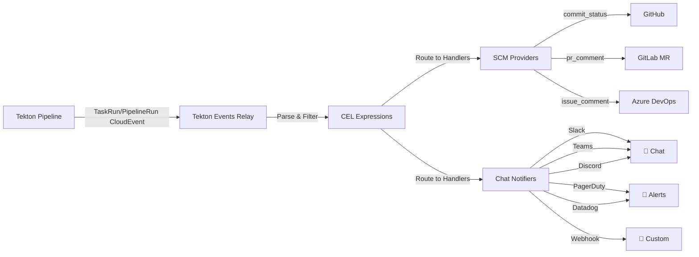

<div align="center">

# Tekton Events Relay

### Stop manually updating CI status across platforms. Automate Tekton pipeline feedback to GitHub, GitLab, Bitbucket, and more.

**Production-ready CloudEvents bridge** that connects Tekton Pipelines to 6 SCM platforms and 6 notification channels with CEL-based routing, template customization, and enterprise authentication support.

---

#### Build Status

[](https://github.com/fabioluciano/tekton-events-relay/actions)
[](https://github.com/fabioluciano/tekton-events-relay/actions)
[](https://github.com/fabioluciano/tekton-events-relay/actions)

#### Project Info

[](https://artifacthub.io/packages/search?repo=tekton-events-relay)
[](https://github.com/fabioluciano/tekton-events-relay/releases)
[](https://go.dev)
[](LICENSE)

</div>

---

## 📑 Table of Contents

- [Key Features](#key-features)
- [Security & Compliance](#-security--compliance)
- [Supported Integrations](#supported-integrations)
- [Why Use Tekton Events Relay?](#-why-use-tekton-events-relay)
- [Quickstart](#quickstart)
- [Event Flow](#-event-flow)
- [When to Use](#-when-to-use-tekton-events-relay)
- [Full Documentation](#full-documentation)
- [Configuration Examples](#configuration-example)
- [Advanced Features](#advanced-features)
- [Architecture](#architecture)
- [Contributing](#contributing)

---

## Key Features

- **Multi-provider Support**: 6 SCM platforms, 6 chat & alerting integrations
- **Template-driven**: Go templates + CEL filtering for custom workflows
- **Production-ready**: HTTP 503 backpressure, deduplication, accumulator pipeline
- **Enterprise-ready**: OAuth2 client credentials, self-managed platform support

---

## 🔐 Security & Compliance

All releases are signed with [Cosign](https://github.com/sigstore/cosign) using keyless OIDC signing. Signatures are stored in the public [Sigstore Rekor](https://rekor.sigstore.dev/) transparency log.

**Verify Docker image signature:**
```bash
cosign verify \
  --certificate-identity-regexp='https://github.com/fabioluciano/tekton-events-relay' \
  --certificate-oidc-issuer='https://token.actions.githubusercontent.com' \
  ghcr.io/fabioluciano/tekton-events-relay:latest
```

**Verify Helm chart signature:**
```bash
cosign verify \
  --certificate-identity-regexp='https://github.com/fabioluciano/tekton-events-relay' \
  --certificate-oidc-issuer='https://token.actions.githubusercontent.com' \
  oci://ghcr.io/fabioluciano/charts/tekton-events-relay:latest
```

> 📋 **SLSA Provenance:** Build provenance attestations are planned for a future release to provide cryptographic verification of the build process. Track progress in future releases.

> 🔒 **Security issues?** Please follow our [responsible disclosure policy](SECURITY.md).

---

## Supported Integrations

### SCM Providers

| GitHub | GitLab | Bitbucket | Azure DevOps | Gitea | SourceHut |
|--------|--------|-----------|--------------|-------|-----------|
|  |  |  |  |  |  |

**Enterprise Deployment Support:**
- **GitLab**: SaaS (gitlab.com) and self-managed instances
- **Bitbucket**: Cloud and Server variants
- **GitHub**: GitHub.com and GitHub Enterprise Server
- **OAuth2**: Client credentials flow for enterprise authentication

### Notifiers

| Slack | Microsoft Teams | Discord | PagerDuty | Datadog | Webhooks |
|-------|-----------------|---------|-----------|---------|----------|
|  |  |  |  |  |  |

### SCM Actions

- **commit_status**: Update commit/PR status
- **check_run**: Create GitHub check runs (rich UI)
- **pr_comment**: Comment on pull requests
- **issue_comment**: Comment on issues
- **discussion_comment**: Comment on discussions
- **deployment_status**: Track environment deployments
- **label**: Automatically label PRs and issues

---

## 💡 Why Use Tekton Events Relay?

### Use Case 1: Multi-Platform CI Visibility
**Problem:** Your team uses GitHub for code but stakeholders check Jira/Azure DevOps for pipeline status.  
**Solution:** Relay updates commit status to GitHub *and* posts to Azure DevOps work items simultaneously, giving everyone visibility in their preferred tool.

### Use Case 2: Smart Failure Notifications
**Problem:** Developers ignore Slack spam from all pipeline runs.  
**Solution:** Use CEL expressions to send Slack alerts only for production failures: `event.Namespace == "production" && event.State == "failure"`. Development runs stay silent.

### Use Case 3: Automated PR Labeling
**Problem:** Reviewers waste time checking whether PR pipelines passed.  
**Solution:** Automatically apply `pipeline::success` or `pipeline::failed` labels to PRs across GitHub, GitLab, and Bitbucket based on pipeline state.

---

## Quickstart

> 📋 **Prerequisites:** Ensure you have Kubernetes 1.24+, Tekton Pipelines v0.40+, and Helm 3.8+ installed before proceeding.

### 1. Install Tekton Pipelines (if not already installed)

```bash
kubectl apply -f https://storage.googleapis.com/tekton-releases/pipeline/latest/release.yaml
```

### 2. Create SCM Provider Secrets

**For GitHub:**
```bash
kubectl create secret generic github-token \
  --namespace tekton-events-relay \
  --from-literal=token="ghp_your_personal_access_token"
```

**For GitLab (Personal Access Token):**
```bash
kubectl create secret generic gitlab-token \
  --namespace tekton-events-relay \
  --from-literal=token="glpat-your_token"
```

**For GitLab (OAuth2 Client Credentials - Enterprise):**
```bash
kubectl create secret generic gitlab-oauth2 \
  --namespace tekton-events-relay \
  --from-literal=client_id="your_client_id" \
  --from-literal=client_secret="your_client_secret"
```

### 3. Install tekton-events-relay via Helm

**GitHub example:**
```bash
helm install tekton-events-relay \
  oci://ghcr.io/fabioluciano/charts/tekton-events-relay \
  --namespace tekton-events-relay --create-namespace \
  --set config.scm.github[0].enabled=true \
  --set config.scm.github[0].auth.secretName=github-token
```

**GitLab SaaS example:**
```bash
helm install tekton-events-relay \
  oci://ghcr.io/fabioluciano/charts/tekton-events-relay \
  --namespace tekton-events-relay --create-namespace \
  --set config.scm.gitlab[0].enabled=true \
  --set config.scm.gitlab[0].variant=saas \
  --set config.scm.gitlab[0].base_url=https://gitlab.com/api/v4 \
  --set config.scm.gitlab[0].auth.secretName=gitlab-token
```

**GitLab self-managed with OAuth2:**
```bash
helm install tekton-events-relay \
  oci://ghcr.io/fabioluciano/charts/tekton-events-relay \
  --namespace tekton-events-relay --create-namespace \
  --set config.scm.gitlab[0].enabled=true \
  --set config.scm.gitlab[0].variant=self-managed \
  --set config.scm.gitlab[0].base_url=https://gitlab.company.example.com/api/v4 \
  --set config.scm.gitlab[0].auth.oauth2.secretName=gitlab-oauth2 \
  --set config.scm.gitlab[0].auth.oauth2.tokenURL=https://gitlab.company.example.com/oauth/token
```

For full configuration options, see the [Installation Guide](https://github.com/fabioluciano/tekton-events-relay/wiki/Installation).

> 💡 **Tip:** Start with a single SCM provider and add more as needed. All providers can coexist in the same deployment.

---

## 📊 Event Flow



---

## 🎯 When to Use Tekton Events Relay

### ✅ Use When:
- **Multi-platform teams**: Need to update GitHub, GitLab, Bitbucket, and chat tools simultaneously
- **Smart filtering**: Want CEL-based conditional routing (e.g., only notify production failures)
- **Template customization**: Need Go templates for custom notification formats
- **Event batching**: Want to accumulate multiple TaskRun events into a single PR comment
- **Enterprise auth**: Require OAuth2 client credentials or self-managed platform support

### ❌ Don't Use When:
- **Single platform**: Only use GitHub and GitHub Actions already handles CI status
- **Native integrations exist**: Your SCM has built-in Tekton integration that meets your needs
- **No filtering needed**: All events should trigger the same action

### 💭 Why Not Just Add Tasks to Your Pipeline?

**Without Tekton Events Relay**, updating commit status requires:
- Adding dedicated status-update Tasks to every pipeline
- Using `finally` blocks to ensure status updates even on failure
- Duplicating notification logic across all pipelines
- Managing credentials and API calls in every pipeline definition

**Result:** Pipeline pollution. Every pipeline becomes bloated with notification Tasks instead of focusing on build/test/deploy logic.

**With Tekton Events Relay:**
- Pipelines stay clean — no notification Tasks needed
- One centralized config handles all status updates
- CEL expressions route events without touching pipeline code
- Add/remove integrations without redeploying pipelines

### 🔥 Unique Capabilities vs Alternatives
| Feature | Tekton Events Relay | Native Tekton Features | Custom Scripts |
|---------|---------------------|------------------------|----------------|
| Multi-SCM simultaneous updates | ✅ Built-in | ❌ Manual per-platform | ⚠️ Must implement |
| CEL-based event filtering | ✅ Built-in | ⚠️ Limited | ⚠️ Must implement |
| Event accumulator (batching) | ✅ Built-in | ❌ Not available | ⚠️ Complex to build |
| Template-driven messages | ✅ Go templates | ❌ Not available | ⚠️ Must implement |
| OAuth2 enterprise auth | ✅ Built-in | ❌ Not available | ⚠️ Must implement |
| Production-ready backpressure | ✅ HTTP 503 handling | ❌ Not available | ⚠️ Must implement |

---

## Full Documentation

> **[ Read the Complete Documentation](https://github.com/fabioluciano/tekton-events-relay/wiki)**

- [Installation Guide](https://github.com/fabioluciano/tekton-events-relay/wiki/Installation) — Deploy to Kubernetes
- [Configuration Reference](https://github.com/fabioluciano/tekton-events-relay/wiki/Configuration) — All configuration options
- [Complete Configuration Example](docs/examples/config.yaml) — Comprehensive example showing all available fields
- [Examples](https://github.com/fabioluciano/tekton-events-relay/wiki/Examples) — Real-world use cases
- [CEL Expressions](https://github.com/fabioluciano/tekton-events-relay/wiki/CEL-Expressions) — Event filtering and routing
- [Troubleshooting](https://github.com/fabioluciano/tekton-events-relay/wiki/Troubleshooting) — Common issues & solutions

---

## Configuration Example

### GitHub Commit Status with CEL Filtering

> 💡 **Tip:** CEL expressions support powerful filtering with `startsWith()`, `endsWith()`, `contains()`, and `matches()` functions to precisely control when actions trigger.

```yaml
scm:
  github:
    - name: main-instance
      enabled: true
      auth:
        secret_file: /etc/secrets/github-token
      actions:
        - name: commit-status
          type: commit_status
          enabled: true
          when: 'event.Resource == "pipelinerun" && event.Repo.Owner == "myorg"'
          filter:
            pipelines:
              allow: ["ci-pipeline", "release-pipeline"]
```

### Slack Notifications for Production Failures

```yaml
notifiers:
  slack:
    - name: production-alerts
      enabled: true
      webhook_url_file: /etc/secrets/slack-webhook
      channel: "#production-alerts"
      when: 'event.Namespace == "production" && event.State == "failure"'
      template: |
        :rotating_light: *PRODUCTION FAILURE*
        *Pipeline:* {{.PipelineName}}
        *Task:* {{.TaskName}}
        *Commit:* `{{.CommitSHA}}`
        {{if .TargetURL}}<{{.TargetURL}}|View Logs>{{end}}
```

---

## Advanced Features

### Pipeline Summary Accumulator

> ⚡ **Performance:** Batch multiple TaskRun events into a single PR comment when the PipelineRun completes, reducing notification noise and API rate limit pressure.

```yaml
accumulator:
  enabled: true
  ttl: 5s
  max_size: 100
```

### CloudEvents Processing

> ⚠️ **Important:** When the internal event queue reaches capacity, the service returns HTTP 503 (Service Unavailable) to implement backpressure. Configure queue size based on your expected event volume.

All events are processed as CloudEvents, enabling:

- **Deduplication**: Built-in LRU cache (10,000 events default)
- **CEL Expressions**: Rich event filtering with `startsWith()`, `endsWith()`, `contains()`, `matches()`
- **Backpressure**: HTTP 503 responses when queue is full
- **OpenTelemetry**: Optional distributed tracing integration

### Template-driven Customization

> 📋 **Note:** Go template variables provide access to all event metadata. Use `{{.FieldName}}` syntax to reference pipeline, run, commit, and repository information in custom messages.

Use Go templates to customize notification messages:

```go
{{.PipelineName}}    // Pipeline name
{{.RunName}}         // Run identifier
{{.State}}           // success, failure, error, running
{{.CommitSHA}}       // Git commit SHA
{{.Namespace}}       // Kubernetes namespace
{{.TargetURL}}       // Link to Tekton Dashboard
{{.Repo.Owner}}      // Repository owner
{{.Repo.Name}}       // Repository name
```

---

## Architecture

- **Event Listener**: CloudEvents webhook endpoint (`/`)
- **Event Filter**: CEL-based conditional routing
- **Action Handlers**: Pluggable SCM and notifier implementations
- **Deduplication**: LRU cache to prevent duplicate notifications
- **Accumulator**: Optional event batching pipeline
- **Metrics**: Prometheus-compatible `/metrics` endpoint

---

## Contributing

Contributions are welcome! Please see [CONTRIBUTING.md](CONTRIBUTING.md) for guidelines.

---

## License

This project is licensed under the MIT License — see the [LICENSE](LICENSE) file for details.

---

## Support

- **Issues**: [GitHub Issues](https://github.com/fabioluciano/tekton-events-relay/issues)
- **Discussions**: [GitHub Discussions](https://github.com/fabioluciano/tekton-events-relay/discussions)
- **Security**: [SECURITY.md](SECURITY.md)
