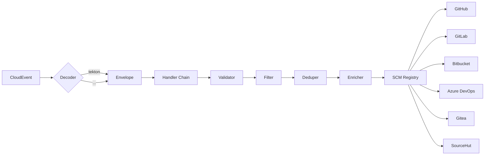

# tekton-events-relay

CloudEvents receiver that performs **multiple SCM actions** across 7 providers:
commit status updates, issue/PR comments with Go templates, and automated labeling.

**Supported SCM Providers:**
- GitHub, GitLab Cloud/Server, Bitbucket Cloud/Server, Azure DevOps, Gitea, SourceHut

**Supported Actions:**
- ✅ Commit status updates (all providers)
- ✅ Issue comments with Go templates (GitHub, GitLab, Gitea)
- ✅ PR/MR comments with Go templates (GitHub, GitLab, Bitbucket, Azure DevOps, Gitea)
- ✅ Automated labels based on build state (GitHub, GitLab, Azure DevOps, Gitea)
- ✅ CEL conditional expressions for action filtering

**Supported Pipeline Engines:**
- **Tekton Pipelines** (native — `tekton-events-controller`)

The architecture is extensible: adding a new engine (Jenkins, GitHub Actions, 
Spinnaker, ...) requires only creating a new `Decoder` file.

## Why

Instead of polluting each Pipeline/Workflow with notification tasks/steps or
exit handlers calling SCM APIs, this service:

1. Listens to CloudEvents from any pipeline engine
2. Decodes the event into a neutral model (Decoder Strategy)
3. Reports the status to the appropriate SCM (Reporter Strategy)

## Architecture



### Design patterns

- **Strategy** (dual): `event.Decoder` (pipeline engine) and `scm.Reporter` (SCM).
- **Registry / Factory**: `event.Registry` and `scm.Registry` resolve at runtime.
- **Adapter**: each SCM in `internal/scm/<name>/` normalizes the corresponding API.
- **Template Method** via composition: `internal/scm/base.go` with hooks
  `BuildURL`, `BuildPayload`, `Auth`, `StateMapper`.
- **Chain of Responsibility**: 5 handlers in `internal/pipeline/`.
- **Builder**: `internal/scm/azuredevops/builder.go` for Azure's nested payload.

## Configuration

**TOML is now the recommended configuration format.** JSON is still supported for backward compatibility but will show a deprecation warning.

### TOML Example

```toml
[server]
addr = ":8080"
read_timeout_sec = 30
write_timeout_sec = 30

dashboard_url = "https://tekton.example.com"
dedupe_size = 1000

[filter]
allow_taskrun = true
allow_pipelinerun = true
ignore_unknown = false

# GitHub with commit status + PR comments + labels
[notifiers.github]
enabled = true
token = "${GITHUB_TOKEN}"
base_url = "https://api.github.com"

[notifiers.github.actions.commit_status]
enabled = true

[notifiers.github.actions.pr_comment]
enabled = true
on_states = ["failure", "success"]
template = """
Build {{ .State }} for run {{ .RunName }}

{{- if .IssueNumber }}
Fixes {{ IssueRef .Provider .IssueNumber }}
{{- end }}

[View logs]({{ .TargetURL }})
"""

[notifiers.github.actions.label]
enabled = true
success_label = "ci:passed"
failure_label = "ci:failed"

# GitLab with commit status + MR notes
[notifiers.gitlab_cloud]
enabled = true
token = "${GITLAB_TOKEN}"
base_url = "https://gitlab.com/api/v4"

# Slack for failure notifications
[notifiers.slack]
enabled = true
webhook_url = "${SLACK_WEBHOOK}"
channel = "#ci-alerts"
notify_on = ["failure", "error"]
```

See [docs/configuration.md](docs/configuration.md) for complete schema and migration guide.

### CEL Conditional Actions (Optional)

Action handlers (PR comments, issue comments, labels) support optional `when` field with CEL expressions for conditional triggering:

```toml
[notifiers.github.actions.pr_comment]
enabled = true
on_states = ["failure"]
# Only trigger for taskrun failures in production namespace
when = 'event.Resource == "taskrun" && event.State == "failure" && event.Namespace == "production"'
template = """
TaskRun {{ .RunName }} failed in {{ .Namespace }}
"""
```

**Available CEL variables:**
- `event.Resource` - "taskrun" or "pipelinerun"
- `event.State` - "success", "failure", "error", etc.
- `event.RunName` - TaskRun/PipelineRun name (metadata.name)
- `event.RunID` - Unique identifier (metadata.uid)
- `event.Namespace` - Kubernetes namespace
- `event.Repo.Owner`, `event.Repo.Name` - Repository info
- String functions: `.startsWith()`, `.contains()`, etc.

See `examples/config.toml` for more CEL examples.

## Metadata convention

Tekton PipelineRun/TaskRun resources declare:

```yaml
metadata:
  labels:
    scm.provider: github
  annotations:
    scm.repo-owner: "fabio"
    scm.repo-name: "my-repo"
    scm.commit-sha: "abc123def456"
    scm.context: "tekton/build"
    # optional: link to issue/PR for comments and labels
    tekton-events-relay.dev/issue-number: "123"
    tekton-events-relay.dev/pr-number: "456"
    # provider-specific optional fields:
    scm.repo-id: "1234"             # GitLab
    scm.repo-workspace: "fabio"     # Bitbucket Cloud
    scm.repo-project: "myproject"   # Azure DevOps / Bitbucket Server
    scm.repo-org: "myorg"           # Azure DevOps
    scm.api-base-url: "https://gitlab.company.com/api/v4"
```

Valid values for `scm.provider`: `github`, `gitlab-cloud`, `gitlab-server`,
`bitbucket-cloud`, `bitbucket-server`, `azure-devops`, `gitea`, `sourcehut`.

**Note:** Issue and PR numbers are optional. If not provided, issue/PR comment and label handlers will skip silently. For GitHub, you can configure optional PR enrichment via API lookup in `config.toml`.

## Connecting Tekton

```yaml
apiVersion: v1
kind: ConfigMap
metadata:
  name: config-events
  namespace: tekton-pipelines
data:
  formats: tektonv1
  sink: http://tekton-events-relay.tekton-notifications.svc.cluster.local
```

Ensure the `tekton-events-controller` Deployment (Tekton v1.12+) is running.

## Local setup

```bash
git clone https://github.com/fabioluciano/tekton-events-relay
cd tekton-events-relay

# Pre-commit hooks (fmt, vet, test, commit-msg)
pip install pre-commit
pre-commit install
pre-commit install --hook-type commit-msg

# Commit message template
git config commit.template .gitmessage

make test
```

## Build and deploy

```bash
go build -o bin/receiver ./cmd/receiver
docker build -t tekton-events-relay:dev .

# Helm chart (OCI registry)
helm install tekton-events-relay oci://ghcr.io/fabioluciano/charts/tekton-events-relay --version 1.0.0
```

See [Helm Installation Guide](docs/helm-installation.md) for complete configuration options.

No external dependencies — only Go stdlib.

## How to add a new pipeline engine

1. Create `internal/event/<engine>/decoder.go` implementing `event.Decoder`.
2. Register in `cmd/receiver/main.go` inside `buildDecoders()`.

Zero changes to existing code.

## How to add a new SCM provider

1. Create `internal/notifier/scm/<provider>/client.go` with shared HTTP client
2. Create action handlers implementing `notifier.ActionHandler`:
   - `status.go` for commit status (required)
   - `issue_comment.go` for issue comments (optional)
   - `pr_comment.go` for PR/MR comments (optional)
   - `label.go` for automated labels (optional)
3. Register handlers in `cmd/receiver/main.go` inside `buildActionHandlers()`
4. Add config structs in `internal/config/config.go`
5. Add field limits to `internal/notifier/scm/limits.go`
6. Add cross-reference syntax to `internal/notifier/scm/references.go`

See GitHub handlers in `internal/notifier/scm/github/` as reference implementation.
