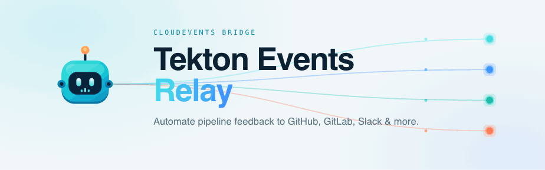
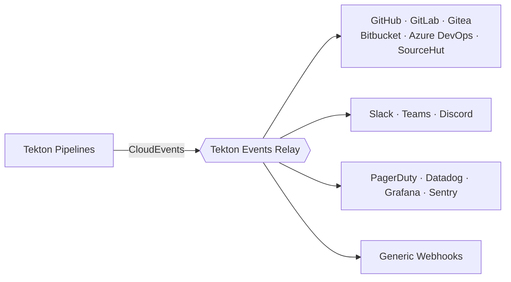

<div align="center">



### Your pipelines run. Your platforms get updated. You write zero notification code.

A production-ready CloudEvents bridge that turns Tekton pipeline events into commit statuses, PR comments, labels, deployments and alerts — across **6 SCM platforms** and **8 notification channels** — driven by annotations and CEL expressions instead of pipeline plumbing.

[](https://github.com/fabioluciano/tekton-events-relay/actions/workflows/release.yaml)
[](https://github.com/fabioluciano/tekton-events-relay/actions/workflows/security-codeql.yaml)
[](https://github.com/fabioluciano/tekton-events-relay/releases)
[](https://artifacthub.io/packages/search?repo=tekton-events-relay)
[](go.mod)
[](https://goreportcard.com/report/github.com/fabioluciano/tekton-events-relay)
[](LICENSE)

**[📖 Documentation](https://github.com/fabioluciano/tekton-events-relay/wiki)** ·
**[⚡ Quickstart](https://github.com/fabioluciano/tekton-events-relay/wiki/Quickstart)** ·
**[🏗 Architecture](https://github.com/fabioluciano/tekton-events-relay/wiki/Architecture)** ·
**[📦 Helm Chart](https://artifacthub.io/packages/search?repo=tekton-events-relay)**

</div>

---

## The problem

Reporting CI status from Tekton means polluting **every pipeline** with notification `Task`s, `finally` blocks, duplicated credentials and copy-pasted curl scripts. Multiply that by every repo, every provider, every chat channel — and pipeline YAML stops being about building software.

## The fix

Tekton already emits a CloudEvent for every state change. The relay listens once, and your config decides what happens — **your pipelines never change**:



Annotate the `PipelineRun` once, in your `TriggerTemplate`:

```yaml
metadata:
  annotations:
    tekton.dev/tekton-events-relay.scm.provider: "github"
    tekton.dev/tekton-events-relay.scm.repo-owner: "my-org"
    tekton.dev/tekton-events-relay.scm.repo-name: "my-repo"
    tekton.dev/tekton-events-relay.scm.commit-sha: "$(tt.params.revision)"
    tekton.dev/tekton-events-relay.scm.pr-number: "$(tt.params.pr-number)"
```

…and declare outcomes in one place:

```yaml
scm:
  github:
    - name: github
      enabled: true
      auth: { secret_name: github-token }
      actions:
        - name: task-checks                # one required check per task
          type: commit_status
          enabled: true
          context_per_task: true
        - name: pr-summary                 # ONE comment that updates itself
          type: pr_comment
          enabled: true
          mode: upsert
          when: 'isPipelineRun() && stateIn("running", "success", "failure")'
        - name: ci-labels                  # declarative label lifecycle
          type: label
          enabled: true
          labels:
            add: ["ci::{{.State}}"]
            remove: ["ci::running", "ci::success", "ci::failure"]

notifiers:
  slack:
    - name: prod-alerts                    # only what's worth waking up for
      enabled: true
      secret_name: slack-webhook
      channel: "#prod-alerts"
      when: 'event.Namespace == "production" && stateIn("failure", "error")'
```

## What it speaks

| Action | GitHub | GitLab | Gitea | Bitbucket | Azure DevOps | SourceHut |
|---|:-:|:-:|:-:|:-:|:-:|:-:|
| `commit_status` (+ per-task checks) | ✅ | ✅ | ✅ | ✅ | ✅ | ✅ |
| `pr_comment` — idempotent `upsert` | ✅ | ✅ | ✅ | ✅* | ✅ | — |
| `commit_comment` (pushes without PR) | ✅ | ✅ | — | — | — | — |
| `issue_comment` / `discussion_comment` | ✅ / ✅ | ✅ / ✅† | ✅ / — | — | — | — |
| `check_run` (rich markdown checks) | ✅ | — | — | — | — | — |
| `deployment_status` (Environments) | ✅ | ✅ | — | — | — | — |
| `label` — declarative add/remove | ✅ | ✅ | ✅ | — | ✅ | — |

\* upsert on Cloud; Server falls back to create. † GitLab `discussion_comment` posts a resolvable MR discussion thread (MR-only). **Plus notifiers:** Slack, Microsoft Teams, Discord, PagerDuty, Datadog, **Grafana deploy annotations**, **Sentry releases**, and generic webhooks with [gojq payload transforms](https://github.com/fabioluciano/tekton-events-relay/wiki/Notifiers#generic-webhook) (DevLake, anyone?).

## Built like infrastructure, not a script

| | |
|---|---|
| 🔁 **Self-updating comments** | `mode: upsert` embeds an invisible marker and edits the same comment as the run progresses — idempotent across retries, restarts and replicas. |
| 🧠 **Routing as expressions** | Every action/notifier is gated by [CEL](https://github.com/fabioluciano/tekton-events-relay/wiki/CEL-Expressions): `event.Namespace == "production" && stateIn("failure")`. Macros included (`isPR()`, `stateIn(…)`). |
| 🗃 **Multi-replica correctness** | Pluggable [state backends](https://github.com/fabioluciano/tekton-events-relay/wiki/Operations#state-backends) — in-memory, **Valkey**, or **embedded Olric** (zero extra deployments) — keep dedup and batching correct at scale. |
| 📮 **Nothing lost** | 429/5xx → retries with jitter honoring `Retry-After`; overload → 503 back-pressure (Tekton retransmits); permanent failures → [dead letter queue with one-call replay](https://github.com/fabioluciano/tekton-events-relay/wiki/Operations#dead-letter-queue). |
| ♻️ **Hot reload** | ConfigMap/secret changes apply without restart — validated first, swapped atomically, counted in metrics. |
| 🔭 **Observable** | 20+ Prometheus metrics, OpenTelemetry traces per handler, and a `/readyz` that tells you *which* provider is failing and why. |
| 🔐 **Hardened** | HMAC webhook auth with replay protection, native TLS, rate limiting, distroless non-root image, Cosign-signed releases. |

## Quickstart

```bash
kubectl create secret generic github-token -n tekton-events-relay \
  --from-literal=token="ghp_..." --dry-run=client -o yaml | kubectl apply -f -

helm install tekton-events-relay \
  oci://ghcr.io/fabioluciano/charts/tekton-events-relay \
  --namespace tekton-events-relay --create-namespace \
  -f values.yaml
```

Point Tekton's `default-cloud-events-sink` at the relay Service, annotate your runs, done. **[Full walkthrough → wiki/Quickstart](https://github.com/fabioluciano/tekton-events-relay/wiki/Quickstart)**

## Documentation

Everything lives in the **[wiki](https://github.com/fabioluciano/tekton-events-relay/wiki)**: [Installation](https://github.com/fabioluciano/tekton-events-relay/wiki/Installation) · [Annotations contract](https://github.com/fabioluciano/tekton-events-relay/wiki/Annotations) · [Configuration reference](https://github.com/fabioluciano/tekton-events-relay/wiki/Configuration-Reference) · [Actions](https://github.com/fabioluciano/tekton-events-relay/wiki/Actions) · [Templates](https://github.com/fabioluciano/tekton-events-relay/wiki/Templates) · [Operations](https://github.com/fabioluciano/tekton-events-relay/wiki/Operations) · [Observability](https://github.com/fabioluciano/tekton-events-relay/wiki/Observability) · [Troubleshooting](https://github.com/fabioluciano/tekton-events-relay/wiki/Troubleshooting) · [Examples](https://github.com/fabioluciano/tekton-events-relay/wiki/Examples)

## Why not just…?

| Alternative | The catch |
|---|---|
| Notification Tasks + `finally` in each pipeline | N× duplicated logic and credentials; pipelines stop being about building. The relay is one deployment and zero pipeline changes. |
| Your SCM's native CI | Then you're not on Tekton. If you are, this *is* the missing feedback layer. |
| A quick webhook script | Congratulations, you now own retries, rate limits, dedup, secrets, HA and metrics. That's this project — already tested. |

## Security & supply chain

All images and charts are **Cosign-signed** (keyless OIDC, recorded in [Rekor](https://rekor.sigstore.dev/)):

```bash
cosign verify \
  --certificate-identity-regexp='https://github.com/fabioluciano/tekton-events-relay' \
  --certificate-oidc-issuer='https://token.actions.githubusercontent.com' \
  ghcr.io/fabioluciano/tekton-events-relay:latest
```

Found a vulnerability? Please follow the [responsible disclosure policy](SECURITY.md).

## Contributing

PRs welcome — see [CONTRIBUTING.md](CONTRIBUTING.md) and the [release flow](https://github.com/fabioluciano/tekton-events-relay/wiki/Contributing-Release-Flow). Releases are fully automated with semantic-release; Conventional Commits required.

## License

[MIT](LICENSE)
